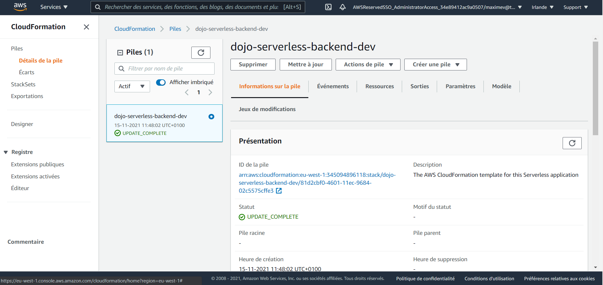
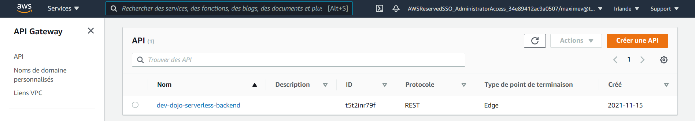
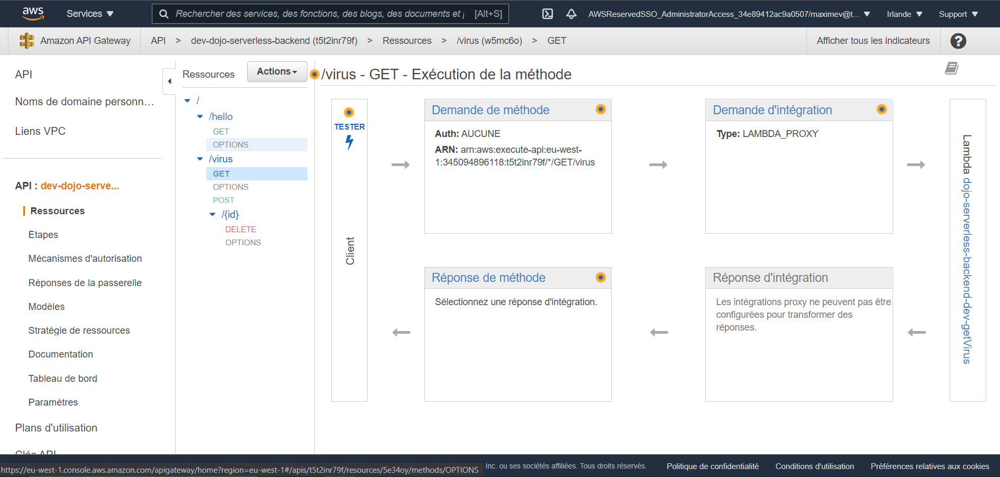
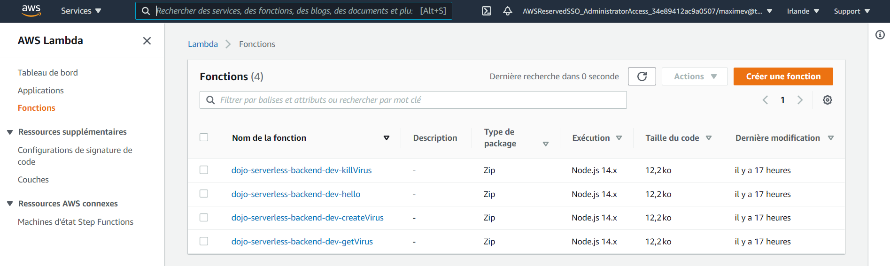
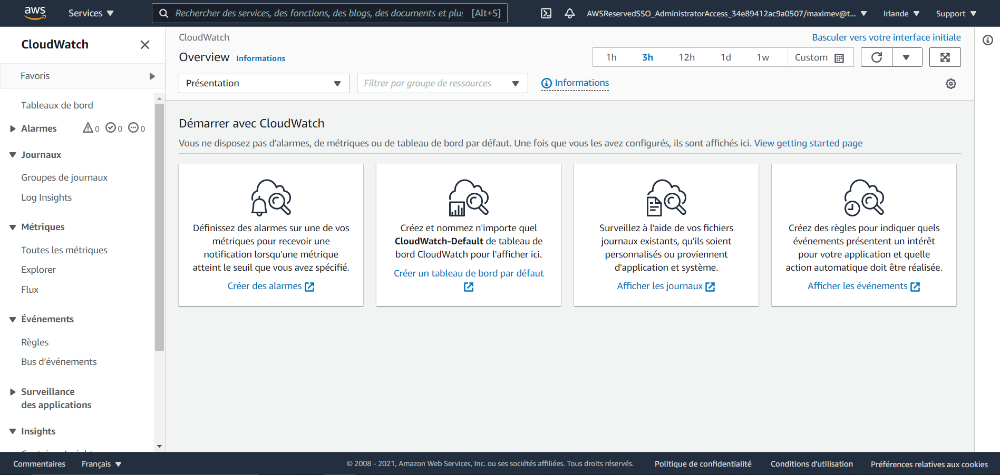
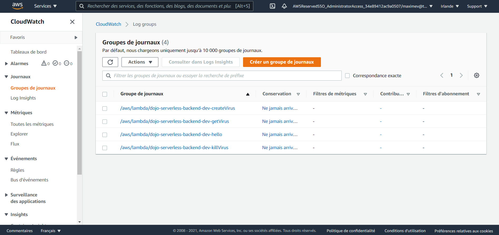

# AWS console guide

## CloudFormation: description of the whole infrastructure

When you search for `CloudFormation` in the search bar and click on the `dojo-serverless-backend-dev` pile you land on that page.
You have informations about the pile in the first tab `informations sur la pile`.
You can follow all update event of the resources you have in your formation in the second tab `événements`.
All the resources that have been provisionned in your infrastructure are listed in the `Ressources` tab.

## API Gateway
When you search for `API Gateway` in the search bar you get that page. You can spot the ID you need to put in the `.env.template.local` in the frontend directory.

Click on the `dev-dojo-serverless-backend` to land on the console of API Gateway.

You can test each endpoint of your API Gateway here.

## AWS Lambda
When you search for `AWS Lambda` in the search bar you get that page. There is the list of all lambda fucntions that have been provided in the infrasructure.

Click on one of the function to land on the console of AWS Lambda of that function.

You can test the function through the tab `Tester`.

## CloudWatch: Debug with logs
When you search for `AWS Lambda` in the search bar you get that page.

You can click on `Groupes de journaux` on the left side of the page to go to the list of lambdas you in your infra.

Then click on the lambda function you want to see the logs of.

To monitor the logs, you can either see all the logs by clicking `Search log group` or you can click on the latest version of the lambda in the `Flux de journaux` section.

## DynamoDB
TODO in session 2
